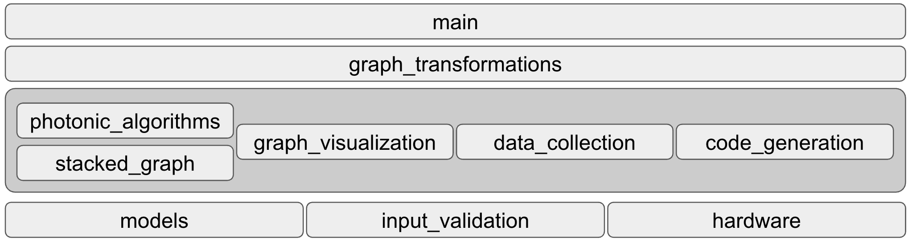
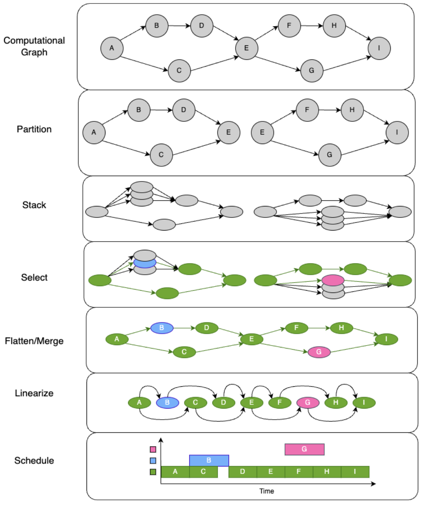
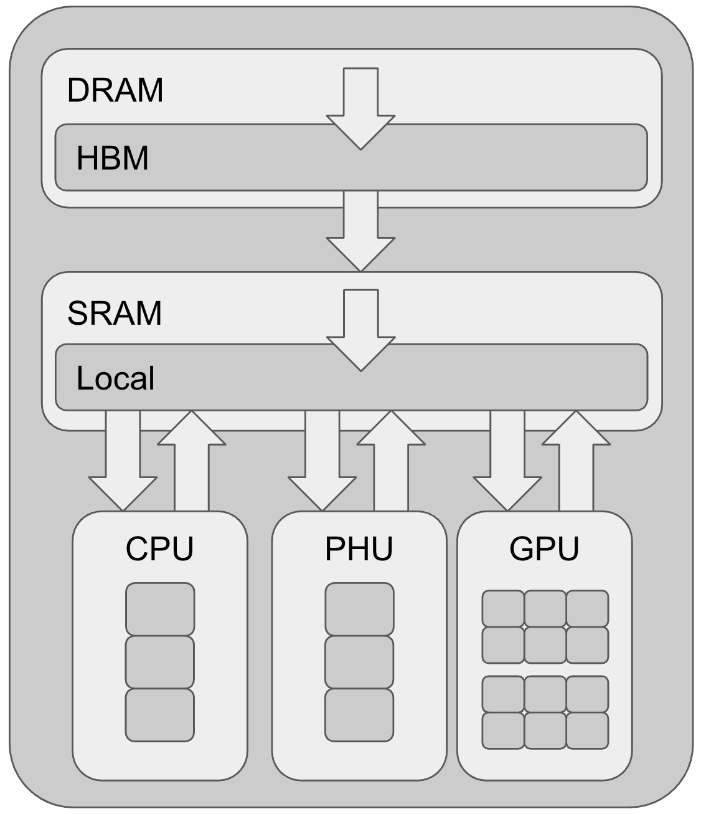

# Architecture

## File Structure

 - Each module only depends on modules below it

Purpose
- main
- graph_transformation
- photonic_algorithms
- stacked_graph
- graph_visualization
- data_collection
- code_generation
- models
- input_validation
- hardware

## Optimization Pipeline

- Computational Graph - Relay IR computational graph in a `.json` format. The output of TVM Relay
- Partition - LLM's are highly repetitive. Searches for articulation nodes[^1], handles edge cases like i/o nodes and residual connections, and splits the computational graph into many subgraphs. Adds moc 'start' nodes to make subgraphs independant.
- Stack - Transformers each subgraph into [Stacked Graph IR](#stacked-graph-ir) by identifying which operations can be executed on which hardware, stacking those various options into a stack.
- Flatten/Merge - Run a dijkstra's style search to identify optimal node selection from each stack. The individual choices of each stack for each subgraph are compiled back into once master 'flattened' computational graph.
- Linearize - Order the computational nodes such that data dependencies are obeyed.
- Schedule - Place nodes into a schedule with individual 'threads' for available cores such that data dependencies are obeyed.

## Stacked Graph IR

Relay IR creates a computational graph. This graph is DAG where nodes represent operations (add, ReLu, matmul, ...) and the directed edges represent data (often a tensor) being passed from the output of the previous node to the next.

The Stacked Graph IR takes this one step further by introducing the Stack.
- Computational Graphs are a DAG of stacks where each stack represents an operation on tensors.
- Stacks are collections of nodes. Each node represents a different algorithm or hardware for doing the same computation.

For example, computational graphs for Machine Learning often have matrix multiplication operations (matmul). The matmul would be represented with a stack. That stack might have 3 nodes. Once conducting the matmul on CPU, one on GPU, another on photonic hardware.

Each node has a [cost function](#arithmatic-hardware-simulator) representing the cost of computation. Each edge has a cost function representing the cost of data transfer. The cost can be different for each node and each edge entering/exiting a node. Each stack has many nodes and hence many in-edges for each 'hyper-edge'[^2].

Key point, during [flattening](#optimization-pipeline) of the graph, only one node is selected from each stack.

## Arithmatic Hardware Simulator

The cost function mentioned in [Stacked Graph IR](#stacked-graph-ir) is calculated using the Arithmetic Hardware Simulator.
Computation cost is based on a linear regression of 'operations' which is self defined and calculated based on the input tensor shapes and the operation being performed. Runtime data is collected on real hardware if available.
Transfer cost is based on the number of bits being sent between locations. For instance, if the result of a photonic matmul needs to be sent to a GPU add, each bit must be sent to local SRAM, then to GPU.

Note: This is an extremely simplified hardware model, especially when considering memory accesses. It was designed to be a quick gauge for how running a computation on a novel hardware might compare. More accurate (and time intensive) hardware models could be added as a separate backend at some point.

[^1]: Node in a DAG such that its removal would split the graph in two. Usually found between layers in many LLm
[^2]: This is a special case [Hypergraph](https://en.wikipedia.org/wiki/Hypergraph) with Hyperedges.
