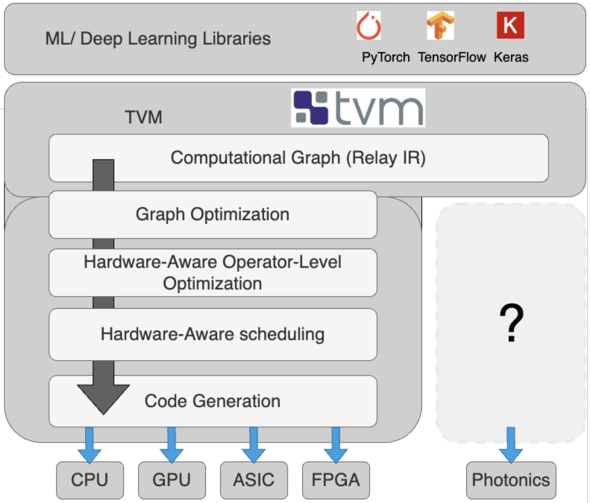
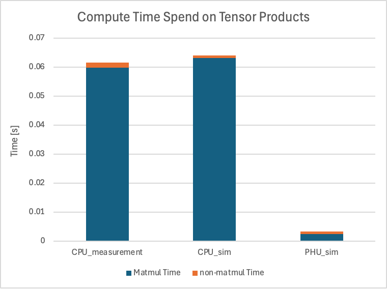
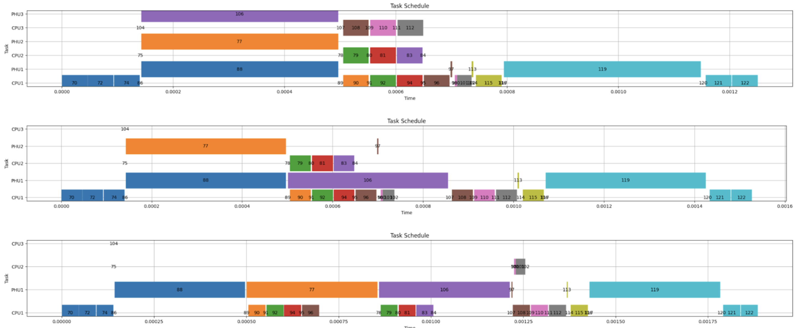

# LightCode: A Compiler Optimization Framework for Multi-Target LLM Compilation

Ryan Tomich, Zhizhen Zhong, Dirk Englund

LightCode is a compiler optimization framework designed to evaluate the speed and efficiency of compiling large language models (LLMs) for both photonic and classical computing architectures.

LightCode begins by leveraging TVM Relay to extract the computational graph from Hugging Face models. This graph is then transformed into a custom intermediate representation (IR) called a stacked graph, which serves as the foundation for optimization and scheduling. Depending on the desired objective—minimizing execution time or energy consumption—LightCode applies arithmetic hardware simulation to determine which operations should be accelerated to minimize the desired quantity. Additionally, LightCode has a sequence-length search function. Given a static computational graph and hardware simulation, it identifies the sequence length at which one computing architecture becomes more efficient than another. This provides the nessessarry information to do dynamic dispatch at runtime based on the user's prompt length.

For the source code, visit the [GitHub repository](https://github.com/RyanTomich/LightCode).

## Documentation

- [Installation Guide](installation.md)
- [Architecture](architecture.md)
- [How-To Guides](how_to.md)
- [Recreating Results](results.md)
- [Testing/Validation](validation.md)
- [Visualizations](model_visualizations.md)
- [Paper Collection](paper_collection.md)

# Background

The growing demand for larger and more complex language models (LLMs) has driven innovation in both model architectures and hardware accelerators [7] [3]. While recent efforts have focused on making LLMs more efficient [1], these models still require large-scale tensor computations, necessitating advancements in GPU architectures and server clusters. However, with the end of Moore’s Law [5], researchers have increasingly turned to specialized hardware accelerators to improve computational efficiency [4]. One promising alternative is photonic computing, which leverages light modulation and propagation for high-speed, low-power computation [9]. Integrating photonic computing into existing machine learning workflows requires adapting the software stack, as current LLM inference pipelines are optimized for electronic hardware like GPUs. These pipelines typically translate models (often written in PyTorch) to CUDA, which is then compiled into assembly for modern GPU architectures. However, new photonic hardware demands a corresponding evolution in compilation strategies LightCode aims to addresses these gaps by providing compilation and optimization tools tailored for photonic accelerators, enabling efficient translation of LLM workloads to novel computing paradigms.

# Introduction

The growth of large language models (LLMs) manifests in several ways. First, increasing the context length—the number of previous tokens a model considers when predicting the next one—expands the size of the key-value (KV) cache required for inference. Second, scaling up the number of parameters results in larger matrices at each encoder-decoder layer and increases the number of layers themselves [6]. Third, training data volume dictates how many inference passes the model must process during training. The first two increase the size and quantity of tensor products throughout an inference request. The third determines the number of inference requests that are required to train the model. As a result of these size increases, most of the computing time for LLM inference is spent on tensor products.

While tensor products dominate the computational workload, encoder-decoder architectures involve additional operations such as normalization, residual connections, activation functions, and softmax, all of which are essential to model functionality [6]. However, photonic hardware is fundamentally limited in the types of operations it can perform, primarily supporting dot-product computations. LightCode bridges this gap by leveraging TVM [2] to analyze the computational structure of any LLM available in the Hugging Face Transformers library [8]. It determines which operations can be efficiently mapped to photonic hardware and utilizes Stacked Graph IR to optimize tensor product execution for photonic accelerators.

# Simulation

**Hardware properties**

CPU
| Property       | Value   |
|:---------------:|:--------:|
| Number of Cores | 1      |
| Clock Speed   | 3.208 GHz |

PHU
| Property             | Value   |
|:----------------------:|:--------:|
| Number of Cores     | 1      |
| Clock Speed         | 9.7 GHz |
| Number of Multiplex Units | 20 [^1] |

GPU [^2]
| Property  | Value  |
|:-----------:|:--------:|
| Graphical Processing Clusters | 8  |
| Texture Processing Clusters per Graphical Processing Cluster | 9  |
| Streaming Multiprocessors per Texture Processing Cluster | 2  |
| FP32 CUDA Cores per Streaming Multiprocessor | 128  |
| Tensor Cores per Streaming Multiprocessor | 4  |
| Clock Speed | 1.98 GHz |

**Raw sim results**

We can use LightCodes `graph_search` feature to calculate the prefill stage of GPT2 on different hardware configurations,

Time optimization
| Hardware  | moc_sequence_length[tok] | Makespan[s] | num_nodes | total_energy[pj] | num_photonic | posiable_photonic |
|:---------:|:------------------------:|:-----------:|:---------:|:----------------:|:------------:|:-----------------:|
| CPU     | 1400 | 30.66707 |  1108 | 161644179672.6 | 0 | 0|
| CPU     | 150 | 2.98404 | 1108 | 50184590920.6 | 0 | 0|
| CPU/PHU | 1400 | 1.93061 |  1518 | 134854955336.6 | 73 | 73|
| CPU/PHU | 150 | 0.13016 | 1518 | 46733526484.6 | 73 | 73|
| GPU     | 1400 | 1.46015 |  1108 | 161867029910.0 | 0 | 0|
| GPU     | 150 | 0.06096 | 1108 | 50208382160.0 | 0 | 0|
| GPU/PHU | 1400 | 1.46015 |  1108 | 161867029910.0 | 0 | 73|
| GPU/PHU | 150 | 0.06096 | 1108 | 50208382160.0 | 0 | 73|

- moc_sequence_length: The length of the sequence used in the simulation.
- Makespan: The total computation time required to generate tokens.
- num_nodes: The number of computational operations in the final graph, which may be larger due to the expansion step in the [optimization pipeline](architecture.md).
- total_energy: The total energy consumed (in pico-Joules) for data movement and computation.
- num_photonic: The number of operations selected to run on photonic hardware for the given parameters.
- possible_photonic: The total number of operations that could potentially be run on photonic hardware.[^3]

each hardware to sequence lenght (CPU, GPU, CPU/PH, GPU/PH)

Scailing law for phu cores

Thresholding Numbers

Scheduling

# Limitations

**Computational Graph Operator Selection:**

In the Transformer architecture, tensor products are not performed sequentially. Instead, they are interspersed with other operations such as addition, normalization, transpose, and activation functions, which the photonic accelerator cannot execute. In contemporary LLM architectures, operations that can be directly accelerated by photonic hardware are rarely sequential. LightCode takes advantage of this assumption to accelerate the 'shortest path' graph search[^4]. For more capable hardware or model architectures where this assumption does not hold, LightCode must revert to a more exhaustive, albeit slower, graph search [quick_heuristic](https://github.com/RyanTomich/LightCode/blob/main/lightcode/graph_transformations.py#L283)

**Graph Caching:**

Modern LLMs contain repetitive subgraph structures due to sequential decoder and encoder layers. By optimizing only unique subgraphs and caching their results, optimization time can be significantly reduced

**Cost Model:**

LightCode uses an arithmetic hardware architecture simulator (see [Architecture](architecture.md#arithmatic-hardware-simulator)). Inputs are the type of operation, size of the tensor operands, and the hardware core average clock speed. If physical hardware is available, experiments can be run to derive a piecewise linear model for number of operations to time. Arithmetic simulation was chosen because cycle-accurate simulators trade simulation time for accuracy. Namely, the gem5 simulator takes over 600 minutes to simulate a transformer [1].

TVM's cost model was not suitable for LightCode because it prioritizes ranking optimization parameters using a learned model, rather than explicitly modeling physical execution time [4].

Photonic accelerators realize improvements by decreasing compute costs at the expense of data movement. Metrics like arithmetic intensity (ARI), or the ratio of computation to memory access, can also be considered [5]. The stepwise nature of photonic and GPU performance introduced by multiplexing, core architecture, memory, and tiling means that the FLOPs/bits would need to be calculated for each tensor shape in a hardware-aware fashion. Probabilistic modeling of cost with consideration of hardware interrupts, cache misses, and general non-determinism could also lead to improvements over many inference requests.

**Decoupling Selection and Scheduling for Improved Concurrency:**

The optimization [pipeline](architecture.md#optimization-pipeline) separates hardware selection from scheduling. This separation is suboptimal as it does not account for hardware concurrency when making selection decisions. Although the PHU may execute an operation faster, if it is occupied while the GPU is idle, scheduling the task on the GPU could reduce overall makespan. This is not currently modeled. One could consider combining the selection and scheduling into one stage to consider both simultaneously.

**Exploring Multi-Hardware Data and Task Parallelism:**
The LightCode hardware simulator assumes that each ‘operation’ as defined by Relay IR is to be done on one type of hardware. This enables task parallelism, but limits data parallelism. Data parallelism must be ‘hard coded’ into the graph expansion step of the optimization pipeline, which LightCode does for photonic matmul. LightCode assumes each Relay IR operation executes on a single hardware type, enabling task parallelism but limiting data parallelism across heterogeneous hardware. Due to the Transformer structure, we often have articulation nodes where no other operation can be done concurrently. In these situations, a performance speedup could be realized by splitting that operation between Photonics and GPU or Photonics and CPU to eliminate processor idle time.

# Future Work

## TVM integration:

**Operator Fusion:**

LightCode bypasses TVM at the Relay stage since it is the final hardware-agnostic layer. The transition from Relay IR to Tensor IR involves memory management and operator fusion, which would necessitate TVM support for photonics.
LightCode leaves all operations unfused to allow unimpeded access to the underlying tensor products. Future work could extend the optimization search space by incorporating operator fusion techniques, allowing for more efficient execution. The selection process could compare these more complex graphs where operations are not 1:1. For example, comparing `photonic_dense()` followed by an electronic `add()` operation to a `dense_add()`fused operation. This new search space could utilize an adapted version of the stacked graph IR to model the space.

**TVM Relax:**
TVM with Relay [7] [6] was limited in that it was designed for pre-autoregressive ML models, meaning it did not support the dynamicism central to modern LLM’s. The TVM community has started development on TVM Unity [3] to address these pitfalls.

## PyTorch integration
PyTorch 2.0 introduces improved support for dynamic computation graphs and compilation, which could enable LightCode’s optimizations to be realized given photonic hardware.
-	[torch.compile ](https://pytorch.org/tutorials/intermediate/torch_compile_tutorial.html)  JIT compiles PyTorch code into optimized kernels
-	[TorchDynamo]( https://pytorch.org/docs/stable/torch.compiler_dynamo_deepdive.html)- Graph Tracing part of torch.compile using the CPython Frame Evaluation API
-	TorchInductor -  Code generator for accelerator backends (OpenAI Triton)
-	[Custom Backends](https://pytorch.org/docs/stable/torch.compiler_custom_backends.html) - Create a backend function that is callable from TorchDynamo.

PyTorch Uses a JIT compiler for optimization and appears to have support for dynamic dispatch[^5] with PrivateUse1 - custom PyTorch backend dispatch key
-	[Multi-device integration ](https://pytorch.org/blog/pt-multidevice-integr ation/)
-	[New Backend Integration](https://pytorch.org/tutorials/advanced/privateuseone.html)

# References

[1]	Abnar, S. et al. 2025. Parameters vs FLOPs: Scaling Laws for Optimal Sparsity for Mixture-of-Experts Language Models. arXiv.

[2]	Chen, T. et al. TVM: An Automated End-to-End Optimizing Compiler for Deep Learning.

[3]	Hoffmann, J. et al. 2022. Training Compute-Optimal Large Language Models. arXiv.

[4]	Peccerillo, B. et al. 2022. A survey on hardware accelerators: Taxonomy, trends, challenges, and perspectives. Journal of Systems Architecture. 129, (Aug. 2022), 102561. DOI:https://doi.org/10.1016/j.sysarc.2022.102561.

[5]	The Death of Moore’s Law: What it means and what might fill the gap going forward | CSAIL Alliances: https://cap.csail.mit.edu/death-moores-law-what-it-means-and-what-might-fill-gap-going-forward. Accessed: 2025-01-31.

[6]	Vaswani, A. et al. 2023. Attention Is All You Need. arXiv.

[7]	Villalobos, P. et al. 2024. Will we run out of data? Limits of LLM scaling based on human-generated data. arXiv.

[8]	Wolf, T. et al. 2020. Transformers: State-of-the-Art Natural Language Processing. Proceedings of the 2020 Conference on Empirical Methods in Natural Language Processing: System Demonstrations (Online, Oct. 2020), 38–45.

[9]	Zhong, Z. et al. 2023. Lightning: A Reconfigurable Photonic-Electronic SmartNIC for Fast and Energy-Efficient Inference. Proceedings of the ACM SIGCOMM 2023 Conference (New York NY USA, Sep. 2023), 452–472.

[^1]: Light of different wavelengths can coexist in the same space without interference. This phenomenon, known as [wavelength division multiplexing (WDM)](https://en.wikipedia.org/wiki/Wavelength-division_multiplexing), enables a single waveguide to carry multiple streams of data simultaneously. Each wavelenght can be [modulated](https://en.wikipedia.org/wiki/Optical_modulator) seperately, enabling parallelized compute. Reasonable multiplexing factors include 20 or more, which would enable a 1:20 vector dot product to be computed simultaneously.

[^2]: This is based roughly on the [NVIDIA H100](https://resources.nvidia.com/en-us-tensor-core). To learn more about some of the basic terminology, check out the [GPU Glossary](https://modal.com/gpu-glossary)

[^3]: In this case, 73 out of 73 possible photonic operations were selected. This indicates that:
The model has 73 total operations that can be computed by a photonic processor (matrix multiplication).
When optimizing for time, the graph search algorithm determined that all 73 operations should be computed using photonics.
If the selection ratio were lower (e.g., 25/73), it would imply that only a subset of operations would benefit from being executed on photonic hardware, likely due to differences in operation sizes (e.g., larger matrix multiplications).

[^4]: Parallels can be drawn to [Dijkstra's algorithm](https://en.wikipedia.org/wiki/Dijkstra%27s_algorithm) and the [group Steiner tree problem](https://www.cs.jhu.edu/~mdinitz/classes/ApproxAlgorithms/Spring2019/Lectures/lecture13.pdf) with stacks being the groups. with the main difference being that the hypergraph is directed.

[^5]: [Dynamic Dispatching](https://en.wikipedia.org/wiki/Dynamic_dispatch), deciding which function to run depending on runtime information, is closely related to  [Dynamic Linking]( https://en.wikipedia.org/wiki/Dynamic_linker), which decides which function to bring from memory at runtime. It is a subject in [Polymorphism](https://en.wikipedia.org/wiki/Polymorphism_(computer_science)).
