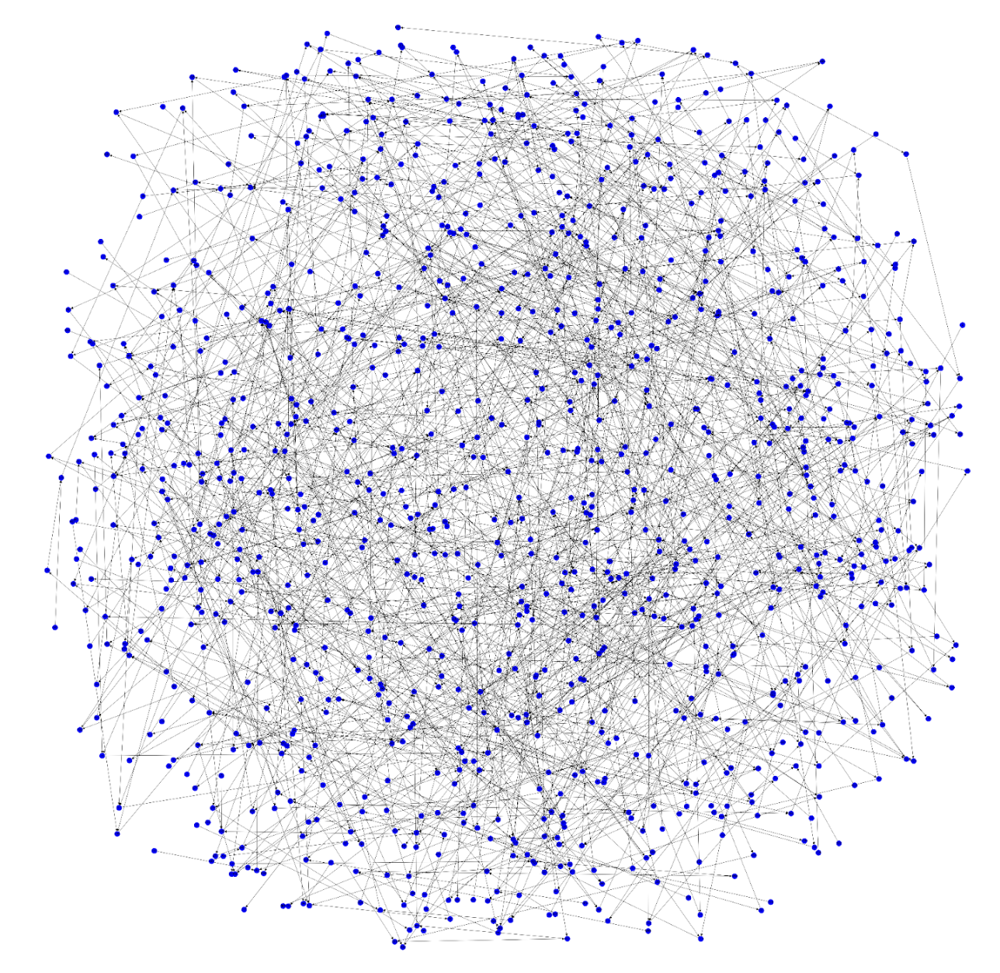
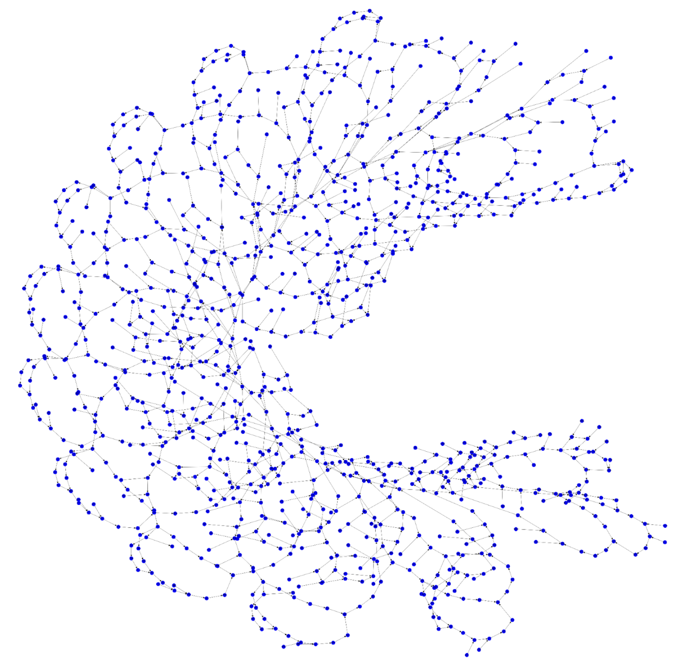
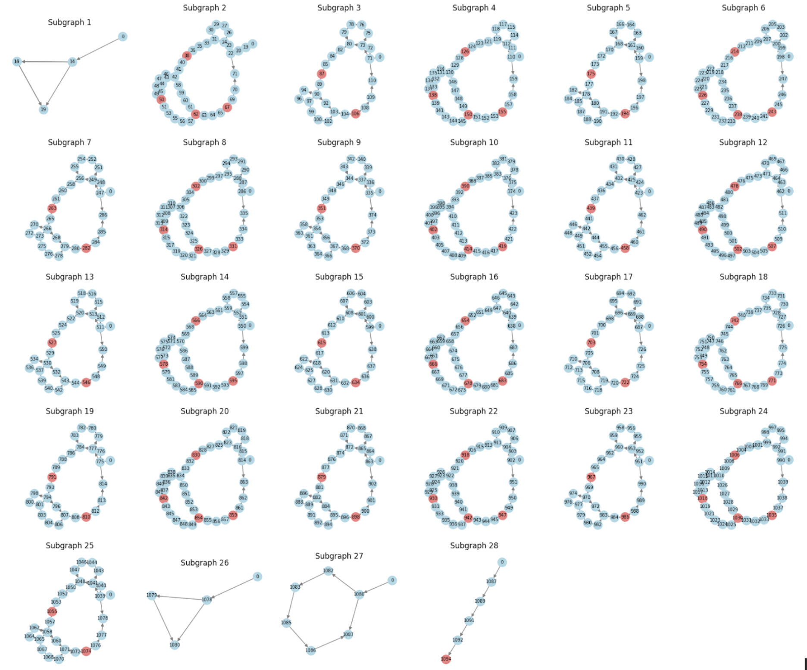
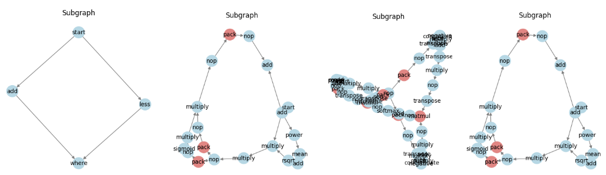
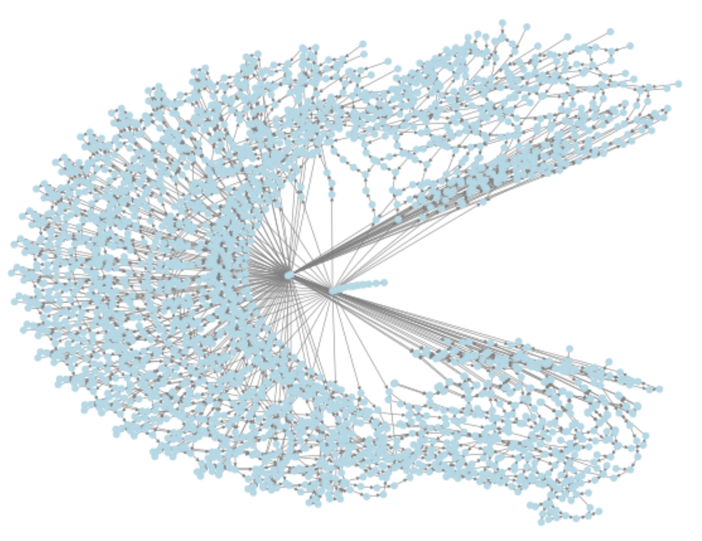
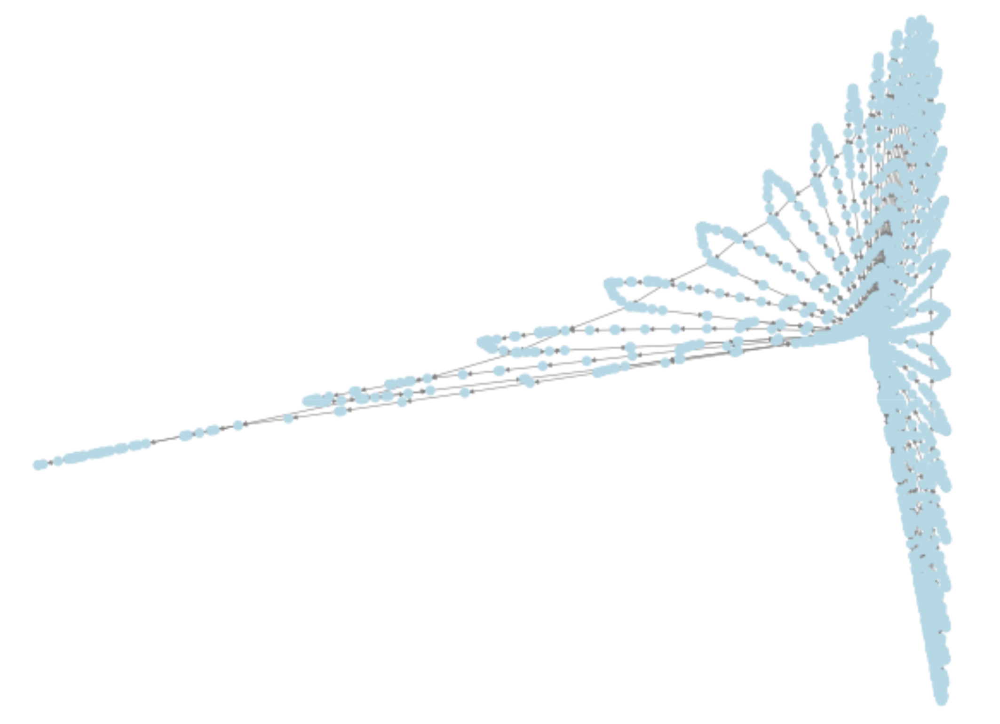

The motovation of this work comes from 2 sources. First is that computation time of LLM inference is dominated by the tensor products. Second, photonics can implement dot products efficiently if they had the stack that other computing platforms had.

The optimization pipeline for the computation graph.

One part of the optimization pipeline involves scheduling the computation graph with each nodes simulated time and assigned hardware. This can be visualized with time on the x axis and hardware core on the y.

# Every Computation in GPT2

# Structured GP2

# GP2 Split by articulation nodes

## Keeping only the Unique Subgraphs

# Every Computation in Llama-7b

# Structured Llama-7b

